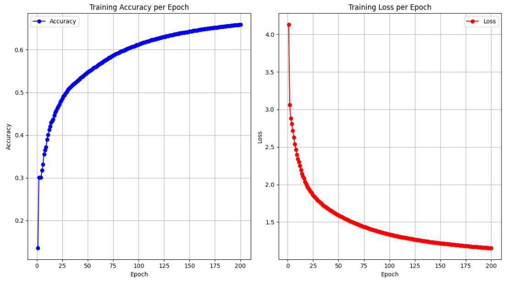
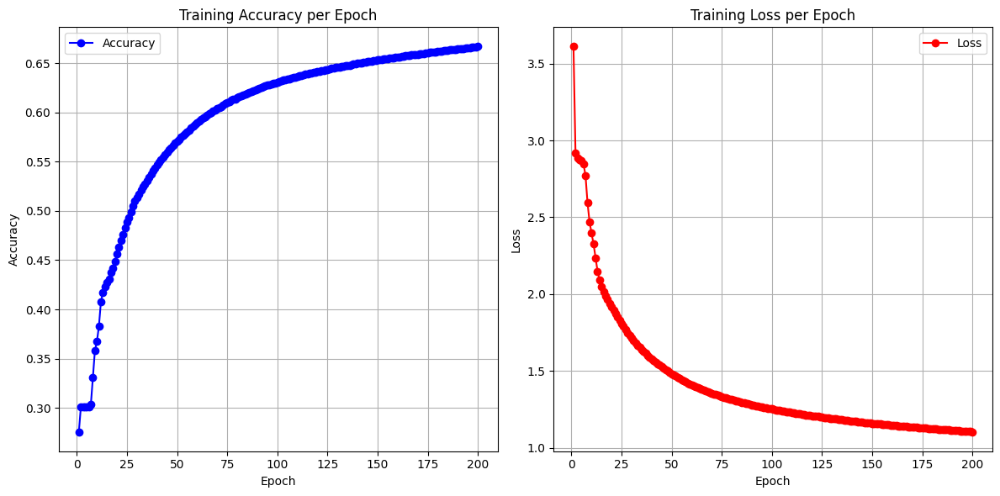
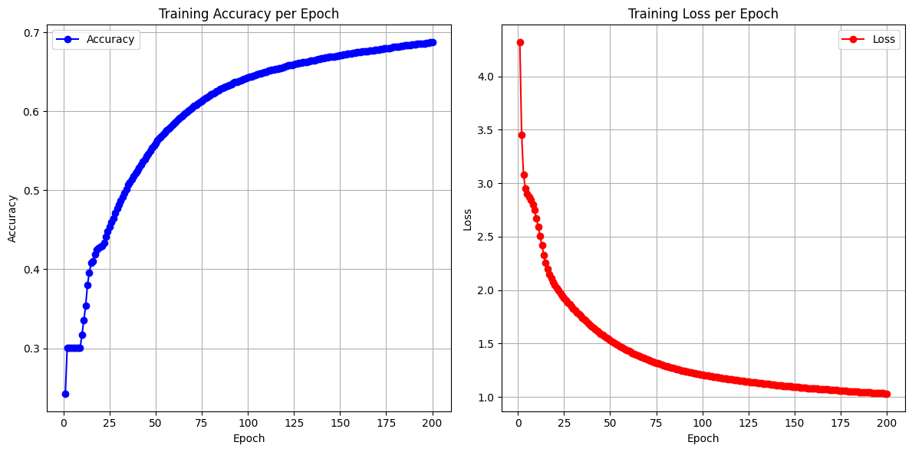
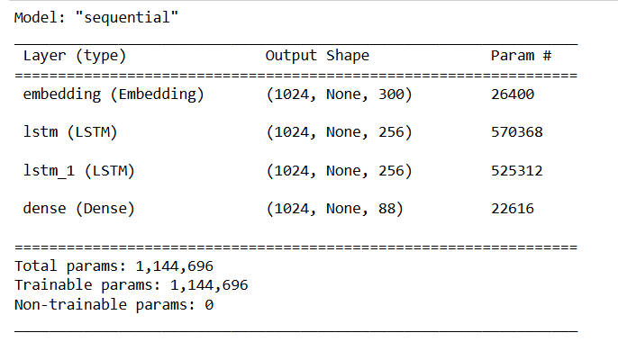
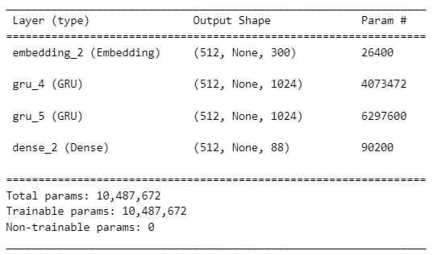

# Wstęp do przetwarzania języka naturalnego (2024Z)

## PROJEKT: Generacja tekstu na podstawie zadanego źródła

**Zespół:**

*   Paweł Sarnacki
*   Marek Rospond
*   Hubert Groen

## Cel projektu
Celem niniejszego projektu było zaimplementowanie modelu do generacji tekstu, bazującego na sieciach rekurencyjnych (RNN) z użyciem biblioteki TensorFlow. Projekt pozwala na:

- Przetworzenie i wstępne przekształcenie danych tekstowych.

- Zbudowanie i trenowanie modelu opartego na różnych wariantach warstw rekurencyjnych (GRU, LSTM, RNN).

- Generowanie nowych fragmentów tekstu na podstawie wytrenowanego modelu.

- Ocenę jakości modelu przy użyciu miary cross-entropy i perplexity.

## Etapy implementacji
1. **Przygotowanie danych**:
   - Zdefiniowano źródło tekstu - pliku `.txt`.
   - Utworzeno mapowania znaków na indeksy (_char2index_) oraz indeksów na znaki (_index2char_).
   - Przekształcono tekst na ciąg liczb odpowiadających indeksom znaków.

2. **Podział danych na sekwencje**:
   - Ustalono długość sekwencji na 100 znaków.
   - Utworzono dataset TensorFlow z sekwencjami o stałej długości (101 znaków, w tym jeden znak docelowy).
   - Podzielono sekwencje na pary wejście-cel, gdzie:
      - _input_text_ zawiera 100 pierwszych znaków.
      - _target_text_ zawiera kolejne 100 znaków (przesunięcie o 1).

3. **Przygotowanie danych do treningu**:
   - Dataset został przetasowany i podzielony na batch'e (testowane wielkości 512-2048) z buforowaniem 10 000 próbek.
   - Określono parametry modelu:
      - Rozmiar słownika (_vocab_size_): liczba unikalnych znaków.
      - Wymiar osadzania (_embedding_dim_): 300.
      - Liczba jednostek w warstwach rekurencyjnych (_rnn_units_): 512 lub 1024 dla dwóch warstw.

4. **Implementacja modelu**:
   -   Zdefiniowano funkcję _build_model_, pozwalającą na budowanie modeli z różnymi typami warstw rekurencyjnych:
         - RNN
         - LSTM
         - GRU

   - Model składa się z:
      - Warstwy osadzania (Embedding).
      - Domyślnie dwóch warstw rekurencyjnych, z możliwością modyfikacji w celach eksperymentalnych.
      - Warstwy gęstej (Dense) przewidującej rozkład prawdopodobieństwa dla kolejnego znaku.

5. **Trenowanie modelu**:
   - Zdefiniowano funkcję straty, używającą _sparse_categorical_crossentropy_.
   - Skonfigurowano model z optymalizatorem _Adam_.
   - Przeprowadzono trening modelu przez 200 epok.

6. **Generacja tekstu**:
   - Załadowano wagi wytrenowanego modelu.
   - Zdefiniowano funkcję _generate_text_, generującą tekst o długości 1000 znaków na podstawie podanego ciągu startowego.
   - Funkcja wykorzystuje rozkład prawdopodobieństwa, aby wprowadzić element losowości do generacji.

7. **Ocena modelu**:
   - Zaimplementowano funkcję _calculate_cross_entropy_loss_, obliczającą średnią entropię krzyżową dla testowych sekwencji.
   - Obliczono wartość _perplexity_, będącą miarą jakości generowanego tekstu (im mniejsza, tym lepsza).

## Wyniki

<figure>
  
  <figcaption style="text-align: center;">RNN: accuracy and loss over epochs</figcaption>
</figure>
  

<figure>
  
  <figcaption style="text-align: center;">LSTM: accuracy and loss over epochs</figcaption>
</figure>
  

<figure>
  
  <figcaption style="text-align: center;">GRU: accuracy and loss over epochs</figcaption>
</figure>
  

|                             | RNN           | LSTM         | GRU          |
| --------------------------- | ------------- | ------------ | ------------ |
| AVERAGE LOSS                | 1.17          | 0.98         | 1.02         |
| PERPLEXITY                  | 3.21          | 2.68         | 2.77         |
| ACCURACY after 200 epochs   | 0.68          | 0.68         | 0.69         |

  
## Appendix

<figure>
  
  <figcaption style="text-align: center;">RNN: model summary</figcaption>
</figure>
  

<figure>
  
  <figcaption style="text-align: center;">LSTM: model summary</figcaption>
</figure>
  

<figure>
  
  <figcaption style="text-align: center;">GRU: model summary</figcaption>
</figure>
  
